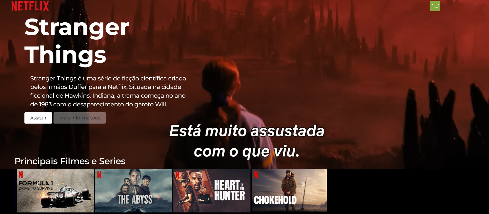
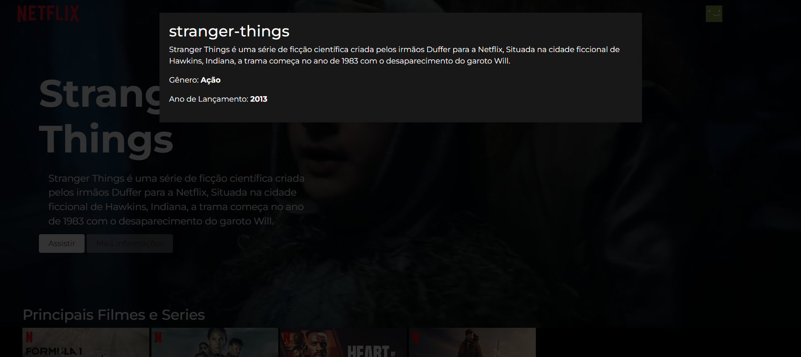

<h1>Este é um projeto meu feito em colaboração com o <a href="https://rodolfomori.com.br/"> Devclub </a></h1>
 
 
<h1> Tecnologias utilizadas: </h1>
 
</>
</>
</>
 
<h1> 🏠 Pagina Inicial: </h1>
 

 
 
<h1> ℹ️ Mais Informações: </h1>
 
</>
<h4> Esta página é um clone simples da interface da Netflix, recriado para fins de estudo. Ao acessar o site, o usuário é recebido com um destaque da série Stranger Things, incluindo um trailer em reprodução e uma seção com mais informações sobre a obra. Logo abaixo, há um carrossel funcional que exibe outros filmes e séries do catálogo, simulando a experiência visual da plataforma original. </h4>
